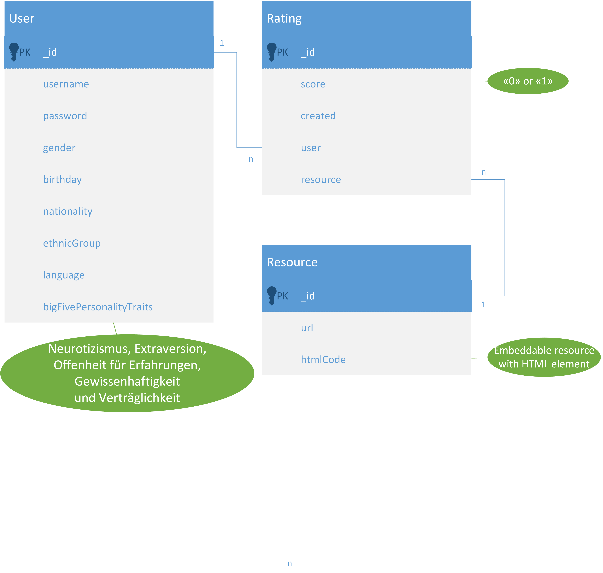

# rating-api
Node.js Applikation für das Integrationsseminar 2 (BSc Wirtschaftsinformatik, ZHAW)

## Installation
1. Start command line and go to your desired working directory
2. Clone git repository: `git clone https://github.com/99999989/rating-api.git`
3. Change directory: `cd rating-api`
4. Install all project dependencies: `npm install`
5. [Download and import Postman Collection](http://svendroid.com/ZHAW/Rating_API.json.postman_collection)

## Start Server 
1. Go to server _bin_ folder: `cd <your working directory>/rating-api/bin`
2. Start the server: `node www`

The server is reachable via [http://localhost:3001/](http://localhost:3001/)

## Debug Server
1. Write a `debugger;`statement wherever needed in the code to stop execution
2. Start command line and go to server _bin_ folder: `cd <your working directory>/rating-api/bin`
3. Start the server in debug mode: `node debug www`

### Stepping

- `cont`, `c` - Continue execution
- `next`, `n` - Step next
- `step`, `s` - Step in
- `out`, `o` - Step out
- `pause` - Pause running code (like pause button in Developer Tools)

### Breakpoints

- `setBreakpoint()`, `sb()` - Set breakpoint on current line
- `setBreakpoint(line)`, `sb(line)` - Set breakpoint on specific line
- `setBreakpoint('fn()')`, `sb(...)` - Set breakpoint on a first statement in functions body
- `setBreakpoint('script.js', 1)`, `sb(...)` - Set breakpoint on first line of script.js
- `clearBreakpoint('script.js', 1)`, `cb(...)` - Clear breakpoint in script.js on line 1

## Routes
- Get a random resource: `GET api/demo/:userId`
- Save rating of random resource: `POST api/rating/`

## Models

